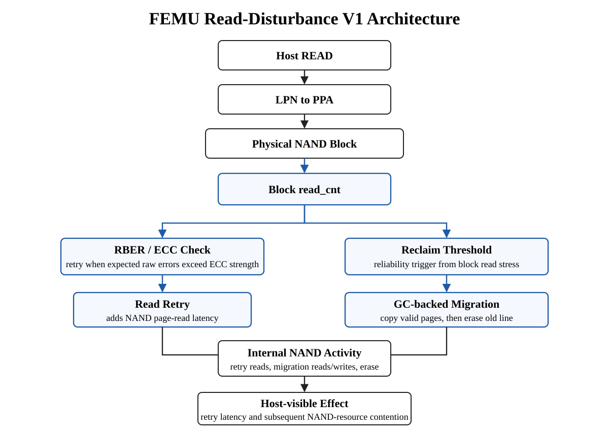

# Read-Disturbance-FEMU

FEMU prototype for modeling system-level overhead caused by NAND read disturbance.

The implementation starts from a clean `MoatLab/FEMU` baseline. Reliability-related state and timing are added directly to the upstream BlackBox SSD path.

## Research question

How can read disturbance be represented in FEMU so that SSD-internal reliability-management overhead becomes visible at the host level?

V1 path:

`host read -> physical read count -> RBER estimate -> ECC threshold -> read retry -> reliability-triggered reclaim -> internal NAND I/O`

The validated V1 uses block-level read stress and GC-backed reclaim. The WL-aware extension is kept on the separate [`wl-aware-straw`](https://github.com/sunwooleeee/Read-Disturbance-FEMU/tree/wl-aware-straw) branch.

## Architecture



The block read counter feeds two reliability-management paths. The RBER/ECC path adds read-retry latency, while the reclaim path reuses FEMU's GC migration primitives and creates additional NAND reads, writes, and erase activity.

## Baseline

- Upstream: `MoatLab/FEMU`
- Baseline commit: `e2d5413ffe432d0b3ed6fef025c611c630e0cded`
- Local development branch: `rd-model`
- Previous Hot/Cold FTL experiments are kept separate from this project.

## Implemented

1. **Physical NAND block read counting**
   - Added `read_cnt` to `struct nand_block`.
   - Incremented it after LPN-to-PPA translation on host reads.
   - Reset it when the block is erased.

2. **RBER / ECC / read-retry abstraction**
   - Uses `RBER = epsilon + alpha * EC^k + gamma * EC^p * RC^q`.
   - `RC` is FEMU's measured block `read_cnt`.
   - ECC strength is modeled as 50 raw-bit errors per 4 KiB page.
   - Retry starts when `page_bits * RBER` exceeds the ECC strength.
   - Each retry adds one NAND page-read latency.

3. **GC-backed read reclaim**
   - Adds configurable `rd_reclaim_threshold`.
   - Reliability logic chooses the stressed line directly; normal GC victim selection is not used.
   - Reuses FEMU's existing `clean_one_block()`, `gc_read_page()`, and `gc_write_page()` migration path.
   - After migration, the old line is erased and returned to the free list.
   - Tracks reclaim events, migrated pages, erases, and deferred threshold hits.

4. **Runtime controls**
   - `rd_enable=0/1`: disable or enable the reliability model.
   - `rd_debug=0/1`: emit sampled retry/reclaim diagnostics.
   - `rd_reclaim_threshold=N`: reclaim threshold; `0` disables reclaim.

The model is disabled by default so baseline FEMU behavior remains available for A/B comparison.

## Validation status

- FEMU incremental build: **PASS**
- QEMU FEMU properties: **PASS** (`rd_enable`, `rd_debug`, `rd_reclaim_threshold`)
- Guest boot and NVMe enumeration: **PASS**
- Repeated-read trigger of RD retry: **PASS**
- First retry boundary under current prototype parameters: **RC = 177**
- GC-backed read reclaim: **PASS** at `RC = 256` in the current validation configuration

The repeated-read runtime validation ran with KVM acceleration. The first retry was logged at `reads=177`, matching the standalone checker (`50.005` expected raw-bit errors versus a 50-bit ECC threshold).

The reclaim validation workload first filled one complete 256-page line, then repeatedly read the same 4 KiB LBA with `rd_reclaim_threshold=256`. Reclaim triggered at `reads=256`, migrated all 256 valid pages through the existing GC copy path, and erased the old line.

Observed runtime markers:

```text
RD retry: blk=0 pg=0 reads=177 erase=0 rber=0.00152603 retries=1 total=1
RD reclaim: line=0 trigger_blk=0 reads=256 pages=256 erases=1 events=1
```

## Important limitation

This is a system-level reliability abstraction, not a transistor-level NAND model. V1 represents read stress with a block-level counter and does not model aggressor/victim wordline relationships.

Read-reclaim V1 operates only on a closed, fully valid FEMU line. Threshold hits on the active or partially written line are deferred so FEMU's existing line-management invariants are not violated.

The RBER parameters are not calibrated to a specific modern 3D NAND device. The separate `wl-aware-straw` branch adds a TLC page-to-WL abstraction and STRAW-inspired ERC/selective reclaim for a controlled policy comparison.

## Reference implementation

FAST'24 CVSS FEMU (`ZiyangJiao/FAST24_CVSS_FEMU`) was examined as a reference for reliability parameters and read-retry modeling. This repository does not use that artifact as its base; the relevant mechanisms are reimplemented on clean upstream FEMU.

See `docs/development-log.md` for implementation rationale and `patches/read-disturbance-femu.patch` for the focused source changes.

## Reproducing the current validation workloads

1. Apply `patches/read-disturbance-femu.patch` to the baseline FEMU commit.
2. Build FEMU and start the small RD-enabled guest with `bash scripts/run-rd-smoke.sh`.
3. For retry-only validation, run `sudo bash scripts/guest-repeated-read.sh /dev/nvme0n1 400` in the guest.
4. For reclaim validation, run `sudo bash scripts/guest-rd-reclaim-smoke.sh /dev/nvme0n1 256 400` in the guest.
5. Check the host FEMU log for `RD retry:` and `RD reclaim:` messages.

The standalone equation check is available as:

```bash
python3 scripts/check-rd-model.py
```

Expected first retry boundary with the current prototype parameters: `RC=177`.

See `results/runtime-smoke-test.txt` for the repeated-read validation log, `results/reclaim-smoke-test.txt` for the reclaim validation log, and `results/status.txt` for the validation summary.
