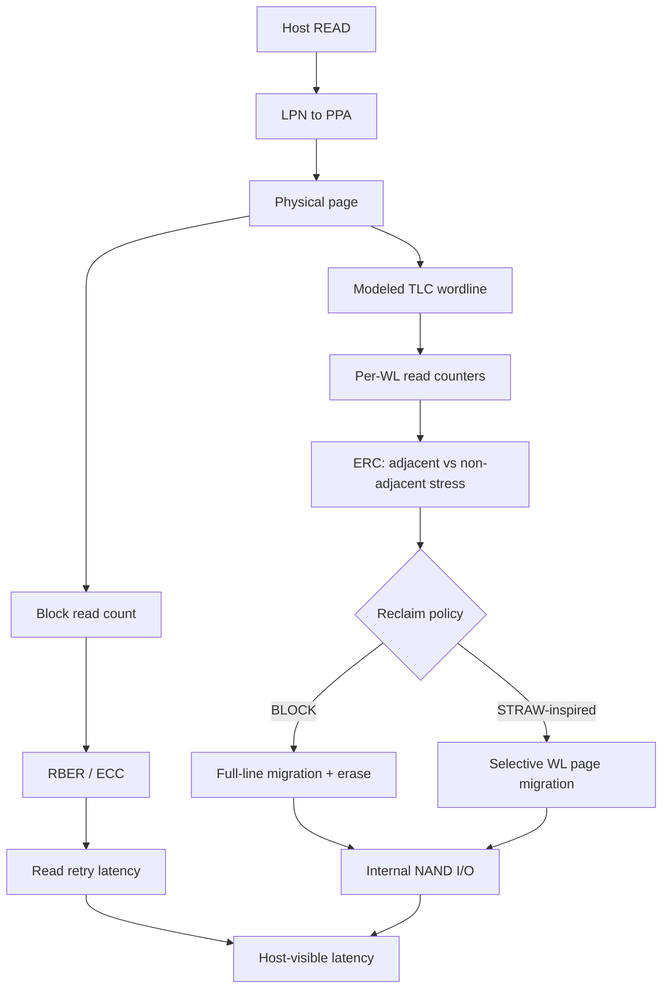

# Read-Disturbance-FEMU

FEMU prototype for studying how NAND read-disturbance management creates internal SSD work and host-visible delay.

This branch extends the validated block-level V1 with a STRAW-inspired wordline-aware reclaim policy.

## Motivation

The 2026 study *Experimental Study on System-Level Performance Impact of Read Disturbance in Modern SSDs* shows that read-disturbance management can strongly affect real SSD performance and points to more realistic SSD simulation as a useful direction.

V1 added the basic path to clean FEMU:

`host read -> block read count -> RBER -> ECC threshold -> read retry -> block/line reclaim`

V2 asks a narrower question: when read stress is uneven across wordlines, how much internal data movement can be avoided by reclaiming only the stressed wordlines?

STRAW is used as the reference for the WL-aware stress idea. This is not a full STRAW reproduction.

References:
- Experimental Study on System-Level Performance Impact of Read Disturbance in Modern SSDs: https://arxiv.org/abs/2608.14073
- STRAW, ASPLOS 2026: DOI 10.1145/3779212.3790228

## Architecture



## WL mapping and ERC

The smoke geometry has 256 FEMU pages per block. V2 uses a simple TLC abstraction with three FEMU pages per modeled WL:

`wl = physical_page / 3`

For victim WL `i`:

`adj = RC[i-1] + RC[i+1]`

`nonadj = block_RC - RC[i] - adj`

`ERC[i] = alpha * adj + nonadj`

The default `alpha` is 8.4. `ERC_MAX` remains configurable because this project does not contain STRAW's complete device-characterization tables.

## Implemented

- Per-block and per-WL read counters.
- FEMU physical-page to modeled-WL mapping.
- STRAW-inspired ERC calculation.
- Policy switch: `BLOCK` or `STRAW-inspired`.
- Selective migration of valid pages on WLs that cross `ERC_MAX`.
- Existing RBER/ECC/read-retry model shared by both policies.
- Runtime controls for WL size, alpha, ERC threshold, and check interval.

## Controlled A/B smoke test

Both policies used the same 1-channel / 1-LUN geometry. One 256-page line was filled, then physical page 30 (modeled WL10) was read 256 times with direct I/O.

BLOCK configuration:
- reclaim threshold: 256 block reads
- migrated pages: 256
- immediate erases: 1

STRAW-inspired configuration:
- 3 pages per modeled WL
- `alpha = 8.4`
- `ERC_MAX = 2150`
- check interval: 8 reads
- adjacent victims: WL9 and WL11
- migrated pages: 6 total
- immediate erases: 0

Observed markers:

```text
RD reclaim: line=0 trigger_blk=0 reads=256 pages=256 erases=1 events=1
RD STRAW WL reclaim: blk=0 wl=9 erc=2150.4 pages=3 total_pages=3
RD STRAW WL reclaim: blk=0 wl=11 erc=2150.4 pages=3 total_pages=6
RD STRAW event: blk=0 reads=256 wls=2 pages=6 events=1
```

In this controlled smoke case, immediate page copies fell from 256 to 6, a 97.7% reduction. This result validates the difference in management granularity; it is not a reproduction of STRAW's published performance numbers.

The shared ECC model still triggered the first read retry at block RC=177 in both runs.

## Limits

- The RBER parameters are not calibrated to a specific modern NAND device.
- The 3-pages-per-WL mapping is a TLC simulator abstraction, not a vendor-specific program order.
- This branch implements the core ERC/selective-reclaim mechanism, not STRAW's full RPT/REC/PVT structures.
- Selective WL migration does not immediately erase the source block; old pages are invalidated and normal FEMU GC reclaims the block later.
- The micro-smoke test demonstrates internal-I/O reduction, not a general host-latency or throughput improvement.

## Files

- `docs/development-log.md`: V1 implementation history.
- `docs/wl-aware-design.md`: V2 mapping, ERC, and policy design.
- `patches/read-disturbance-femu.patch`: focused V1 source changes.
- `patches/read-reclaim-v1.patch`: V1 GC-backed reclaim addition.
- `patches/wl-aware-straw-v2.patch`: V2 WL-aware source and smoke-test changes.
- `results/wl-policy-comparison.txt`: BLOCK vs STRAW-inspired result summary.
- `results/wl-block-policy-smoke.txt`: BLOCK runtime evidence.
- `results/wl-straw-policy-smoke.txt`: STRAW-inspired runtime evidence.
- `scripts/check-wl-erc.py`: deterministic WL/ERC checker.
- `scripts/guest-wl-policy-smoke.sh`: guest A/B workload.

## Runtime controls

```text
rd_reclaim_policy=0|1        # 0=BLOCK, 1=STRAW-inspired
rd_reclaim_threshold=N       # BLOCK trigger
rd_pages_per_wl=3
rd_straw_erc_max=N
rd_straw_alpha_x1000=8400
rd_straw_check_interval=N
```

V1 is preserved at tag `rd-v1` in the development tree. The public `main` branch remains the validated V1 artifact; this `wl-aware-straw` branch contains V2.
