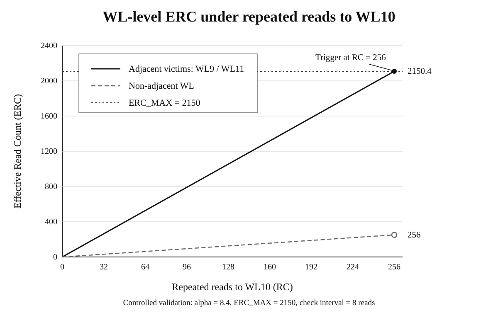
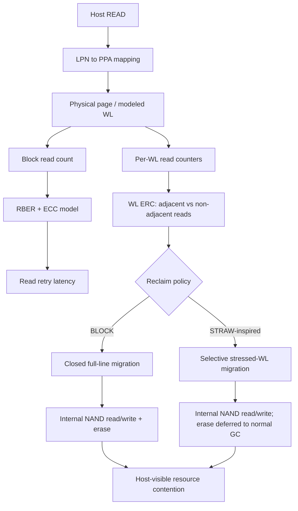

# WL-Aware Read-Disturbance V2 Design

## Motivation

The V1 prototype models read disturbance at NAND-block granularity. It can expose read-retry latency and GC-backed read reclaim, but it cannot distinguish which wordlines receive more disturbance from a given read pattern.

The 2026 study *Experimental Study on System-Level Performance Impact of Read Disturbance in Modern SSDs* reports that observations from commodity SSDs can help build SSD simulators that model read-disturbance performance effects more realistically. V2 uses that system-level motivation while keeping the implementation in FEMU.

Reference: https://arxiv.org/abs/2608.14073

STRAW shows that read-disturbance stress is heterogeneous across wordlines and that reads to adjacent wordlines can be substantially more damaging than non-adjacent reads. V2 uses a simplified WL-aware stress model inspired by STRAW for a controlled policy comparison in FEMU.

Reference: STRAW, ASPLOS 2026, DOI 10.1145/3779212.3790228

## V2 scope

This branch uses a simplified STRAW-inspired model. It does not reproduce STRAW's full device-characterization tables or RPT/REC/PVT metadata structures.

The V2 comparison is:

- `BLOCK`: the validated V1 policy that migrates a complete closed line and erases it.
- `STRAW-inspired`: compute per-WL effective read count (ERC) and migrate only valid pages on WLs whose ERC reaches the configured threshold.

## FEMU page-to-WL mapping

The validation geometry uses 256 FEMU pages per block. V2 uses a simple TLC abstraction with three FEMU pages per modeled WL:

`wl = physical_page / 3`

Thus pages 0-2 map to WL0, pages 3-5 to WL1, and so on. A 256-page block contains 86 modeled WLs, with the final WL containing one page. This mapping is an explicit simulator abstraction and does not claim to reproduce a vendor-specific NAND program sequence.

## STRAW-inspired ERC

For victim WL `i`, V2 separates reads into adjacent and non-adjacent sources:

`adj = RC[i-1] + RC[i+1]`

`nonadj = block_RC - RC[i] - adj`

`ERC[i] = alpha * adj + nonadj`

The default `alpha` is 8.4 (`rd_straw_alpha_x1000=8400`) to match STRAW's reported average adjacent/non-adjacent disturbance ratio. The ERC threshold remains a configurable simulator parameter because this project does not have the paper's complete per-WL-group, per-PEC characterization tables.

For the controlled validation workload, only modeled WL10 is repeatedly read. The ERC of adjacent victim WL9/WL11 therefore grows as `8.4 * RC`, while a non-adjacent WL grows as `RC`. With `ERC_MAX=2150`, the adjacent victims reach `2150.4` at `RC=256`.

## Controlled A/B mechanism validation

Both policies use the same 1-channel / 1-LUN geometry, fill one complete 256-page line, and repeatedly read physical page 30 (modeled WL10). WL9 and WL11 are the adjacent victim WLs.

Validation configuration:

- BLOCK: `rd_reclaim_threshold=256`
- STRAW-inspired: `alpha=8.4`, `ERC_MAX=2150`, check every 8 reads
- workload: 256 direct 4 KiB reads to page 30

At 256 reads, each adjacent victim reaches ERC 2150.4. The thresholds are chosen so that the first management event occurs at approximately the same read count, allowing the migration granularity of the two policies to be compared directly.

The runtime validation moved 256 valid pages and erased one block under BLOCK, versus 6 valid pages across the two adjacent WLs with no immediate erase under the STRAW-inspired policy.

This result is specific to the controlled validation workload. It is not a host-performance result and does not reproduce STRAW's published evaluation numbers.

## Current limitations

- Block-level RBER parameters are inherited from the V1 reference model and are not calibrated to a specific modern NAND device.
- The page-to-WL mapping is a TLC abstraction, not a vendor-specific program-order model.
- V2 implements a simplified ERC/selective-reclaim path, not STRAW's full RPT/REC/PVT design.
- Selective WL reclaim invalidates migrated old pages and relies on normal FEMU GC to erase the block later.

## Architecture overview

The two policies share the same FEMU FTL and NAND timing path. The comparison changes only the reliability-management decision and migration granularity.
